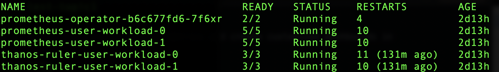
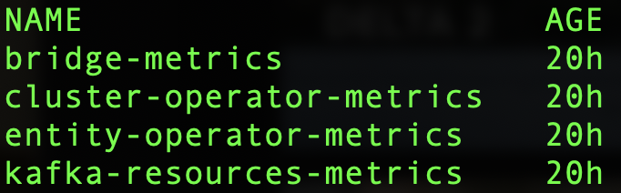
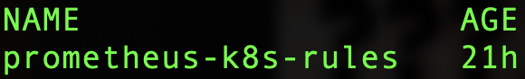

## Kafka Monitoring with Grafana and Prometheus

We customize ```Prometheus``` define rules to scrape AMQ Streams (Kafka) metrics and create customized dashboards in ```Grafana``` for displaying.

## Pre-requisites and Dependencies

### Cluster Admin Roles
- Monitoring for ```user-defined projects``` is enabled 
- Your cluster admin has created a ```cluster-monitoring-config``` config map in your OpenShift cluster
- Your cluster admin has assigned you a ```monitoring-rules-edit``` or ```monitoring-edit``` role
- Details for setting up OpenShift monitoring and user-defined-workload monitoring can be found here in official Red Hat documentation:  
https://access.redhat.com/documentation/en-us/openshift_container_platform/4.10/html/monitoring/monitoring-overview


### Openshift User-Workload-Monitoring
* Verify that monitoring for user-defined projects is enabled:
<div class="snippet-clipboard-content notranslate position-relative overflow-auto" data-snippet-clipboard-copy-content="oc get pods -n openshift-user-workload-monitoring"><pre class="notranslate"><code>oc get pods -n openshift-user-workload-monitoring</code></pre></div>
* If enabled, pods for the monitoring components are returned. For example:  



* If no pods are returned, monitoring for user-defined projects is disabled.  
You need to following the instructions in section ```2.3. Preparing to configure the monitoring stack```  
https://access.redhat.com/documentation/en-us/openshift_container_platform/4.10/html-single/monitoring/index#configuring-the-monitoring-stack. 


## Install PodMonitors

- Multiple PodMonitor resources are defined in: 
https://github.com/strimzi/strimzi-kafka-operator/blob/main/examples/metrics/prometheus-install/strimzi-pod-monitor.yaml
- Save a copy of the yaml to your local filesystem, you will be making changes to your local copy in next step.
- For each PodMonitor resource, edit the ```spec.namespaceSelector.matchNames``` property to match the namespace of your choice.

```yaml
apiVersion: monitoring.coreos.com/v1
kind: PodMonitor
metadata:
  name: cluster-operator-metrics
  labels:
    app: strimzi
spec:
  selector:
    matchLabels:
      strimzi.io/kind: cluster-operator
  namespaceSelector:
    matchNames:
      - <project-name> 
  podMetricsEndpoints:
  - path: /metrics
    port: http
...
```

- Deploy the pod monitors to the namespace where your Kafka cluster is running. 
```shell
oc apply -f strimzi-pod-monitor.yaml -n <project-name>
```
- Deploy the example Prometheus rules to the same project. 
https://github.com/strimzi/strimzi-kafka-operator/blob/main/examples/metrics/prometheus-install/prometheus-rules.yaml. 
(use the copy from GitHub, no need to make changes.)
```shell
oc apply -f prometheus-rules.yaml -n <project-name>
```
- Following screenshots show successful deployment of PodMonitors and PrometheusRule. 
 

