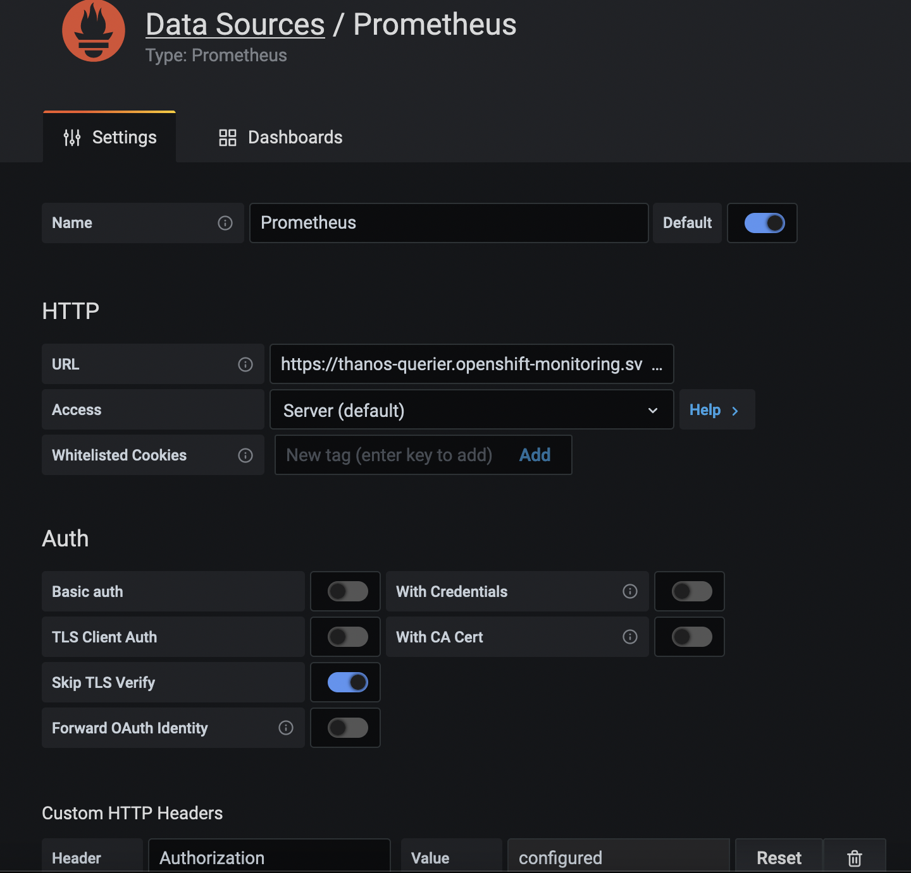

## Kafka Monitoring with Grafana and Prometheus

We customize ```Prometheus``` define rules to scrape AMQ Streams (Kafka) metrics and create customized dashboards in ```Grafana``` for displaying.

## Pre-requisites and Dependencies

### Cluster Admin Roles
- Monitoring for ```user-defined projects``` is enabled 
- Your cluster admin has created a ```cluster-monitoring-config``` config map in your OpenShift cluster
- Your cluster admin has assigned you a ```monitoring-rules-edit``` or ```monitoring-edit``` role
- Details for setting up OpenShift monitoring and user-defined-workload monitoring can be found here in official Red Hat documentation:  
https://access.redhat.com/documentation/en-us/openshift_container_platform/4.10/html/monitoring/monitoring-overview


### Openshift User-Workload-Monitoring
* Verify that monitoring for user-defined projects is enabled:
<div class="snippet-clipboard-content notranslate position-relative overflow-auto" data-snippet-clipboard-copy-content="oc get pods -n openshift-user-workload-monitoring"><pre class="notranslate"><code>oc get pods -n openshift-user-workload-monitoring</code></pre></div>
* If enabled, pods for the monitoring components are returned. For example:  


* If no pods are returned, monitoring for user-defined projects is disabled.  
You need to following the instructions in section ```2.3. Preparing to configure the monitoring stack```  
https://access.redhat.com/documentation/en-us/openshift_container_platform/4.10/html-single/monitoring/index#configuring-the-monitoring-stack. 


## Install PodMonitors and PrometheusRule

- Multiple PodMonitor resources are defined in: 
https://github.com/strimzi/strimzi-kafka-operator/blob/main/examples/metrics/prometheus-install/strimzi-pod-monitor.yaml
- Save a copy of the yaml to your local filesystem, you will be making changes to your local copy in next step.
- For each PodMonitor resource, edit the ```spec.namespaceSelector.matchNames``` property to match the namespace of your choice.

```yaml
apiVersion: monitoring.coreos.com/v1
kind: PodMonitor
metadata:
  name: cluster-operator-metrics
  labels:
    app: strimzi
spec:
  selector:
    matchLabels:
      strimzi.io/kind: cluster-operator
  namespaceSelector:
    matchNames:
      - <project-name> 
  podMetricsEndpoints:
  - path: /metrics
    port: http
...
```

- Deploy the pod monitors to the namespace where your Kafka cluster is running. 
```shell
oc apply -f yaml/strimzi-pod-monitor.yaml -n <project-name>
```
- Deploy the example Prometheus rules to the same project. 
https://github.com/strimzi/strimzi-kafka-operator/blob/main/examples/metrics/prometheus-install/prometheus-rules.yaml. 
(use the copy from GitHub, no need to make changes.)
```shell
oc apply -f prometheus-rules.yaml -n <project-name>
```
- Following screenshots show successful deployment of PodMonitors and PrometheusRule. 
```shell
oc get podmonitor -n <project-name>
```
 
```shell
oc get prometheusrule -n <project-name>
```


## Grafana Credentials: ServiceAccount, ClusterRoleBinding

- Create a ```ServiceAccount``` for Grafana. Here the resource is named ```grafana-serviceaccount```. 
```yaml
apiVersion: v1
kind: ServiceAccount
metadata:
  name: grafana-serviceaccount
  labels:
    app: strimzi
```
- Deploy the ```ServiceAccount``` to the project containing your Kafka cluster. 
```shell
oc apply -f yaml/serviceaccount.yaml -n <project-name>
```
- Create a ```ClusterRoleBinding``` resource that assigns the ```cluster-monitoring-view``` role to the Grafana ServiceAccount. 
```yaml
apiVersion: rbac.authorization.k8s.io/v1
kind: ClusterRoleBinding
metadata:
  name: grafana-cluster-monitoring-binding
  labels:
    app: strimzi
subjects:
  - kind: ServiceAccount
    name: grafana-serviceaccount
    namespace: amq-streams
roleRef:
  kind: ClusterRole
  name: cluster-monitoring-view
  apiGroup: rbac.authorization.k8s.io
```
- Deploy the ```ClusterRoleBinding``` to the project containing your Kafka cluster. 
```shell
oc apply -f yaml/clusterrolebinding.yaml -n <project-name>
```

## Deploying Grafana with a Prometheus datasource
- OCP includes a ```Thanos Querier``` instance in the ```openshift-monitoring``` project. It is used to aggregate platform metrics.  
- To consume the required platform metrics, your Grafana instance requires a ```Prometheus data source``` that can connect to ```Thanos Querier```. To configure this connection, you create a ```ConfigMap``` that authenticates, by using a token, to the ```oauth-proxy``` sidecar that runs alongside Thanos Querier. A ```datasource.yaml``` file is used as the source of the config map. 
- Finally, you deploy the Grafana application with the config map mounted as a ```volume``` to the project containing your Kafka cluster. 

### Grafana/Prometheus Deployment Steps
- Get the access token of the Grafana ServiceAccount
```shell
oc serviceaccounts get-token grafana-serviceaccount -n <project-name>
```
- Create a ```datasource.yaml``` file containing the Thanos Querier configuration for Grafana. 
Paste the access token into the ```httpHeaderValue1``` property as indicated:  
```yaml
apiVersion: 1
datasources:
- name: Prometheus
  type: prometheus
  url: https://thanos-querier.openshift-monitoring.svc.cluster.local:9091
  access: proxy
  basicAuth: false
  withCredentials: false
  isDefault: true
  jsonData:
    timeInterval: 5s
    tlsSkipVerify: true
    httpHeaderName1: "Authorization"
  secureJsonData:
    httpHeaderValue1: 'Bearer ${GRAFANA-ACCESS-TOKEN}"
  editable: true
```
- Create a config map named ```grafana-config``` from the datasource.yaml file:
```shell
oc create configmap grafana-config --from-file=datasource.yaml -n <project-name>
```
- Deploy the Grafana application to the project containing your Kafka cluster:
```shell
oc apply -f yaml/grafana.yaml -n <project-name>
```
- Verify the Grafana pod is running
- Create Openshift Route to Grafana portal using either Openshift Admin Console or command line
```shell
oc create route edge <grafana-route-name> --service=grafana --namespace=<project-name>
```
#### Troubleshooting Tips: Grafana Connection Issues to Prometheus Datasource
- Delete the existing ```Prometheus Data Source``` from Grafana->Configuration->Data Sources
- Add a new ```Prometheus Data Source```
- Fill out these fields in the data source configuration screen
  - URL: ```https://thanos-querier.openshift-monitoring.svc.cluster.local:9091```
  - Skip TLS Verify: ```true```
  - Add a Custom HTTP Header called ```Authorization```
  - Value in this format: ```Bearer <your-token>```
  - Click ```Save & Test``` button
  - If error, repeat above steps, take care to not have any spaces or typos in the bearer token string. 



## Importing the example Grafana dashboards
