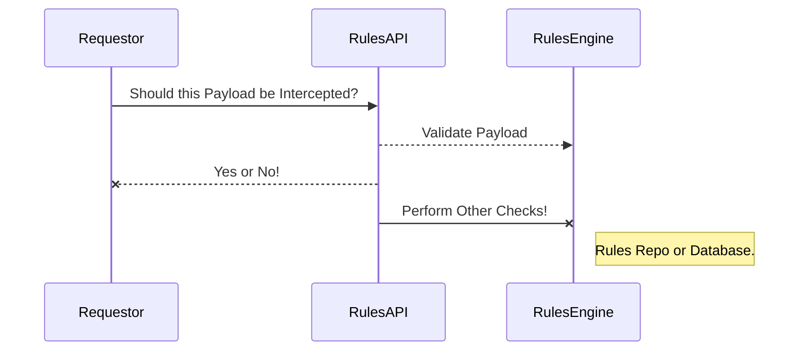
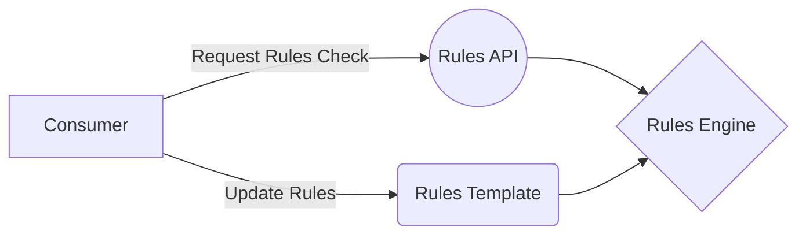

## JSON Rules Engine and Template Proof-of-Concept

We customize the open-source upstream ```json-rules-engine``` project to perform TMF-API Validations.

## Features

* Rules specified in JSON templates
* Full support for ```ALL``` and ```ANY``` boolean operators
* Specify ```priority levels``` and cache settings for fine tuning performance
* REST API interface
* Container Image on Docker Hub
* Can be deployed on OpenShift as Pod
* Can be part of EIP design pattern (as a Camel REST endpoint route)
* Can be exposed using OpenShift Route

## Installation

<div class="snippet-clipboard-content notranslate position-relative overflow-auto" data-snippet-clipboard-copy-content="oc apply -f rulesapi-v1.yaml -n {your namespace}"><pre class="notranslate"><code>oc apply -f rulesapi-v1.yaml -n {your namespace}</code></pre></div>

## Components - Rules

Rules contain a set of _conditions_ and a single _event_.  When the engine is run, each rule condition is evaluated.  If the results are truthy, the rule's _event_ is triggered.



Flow Chart:


