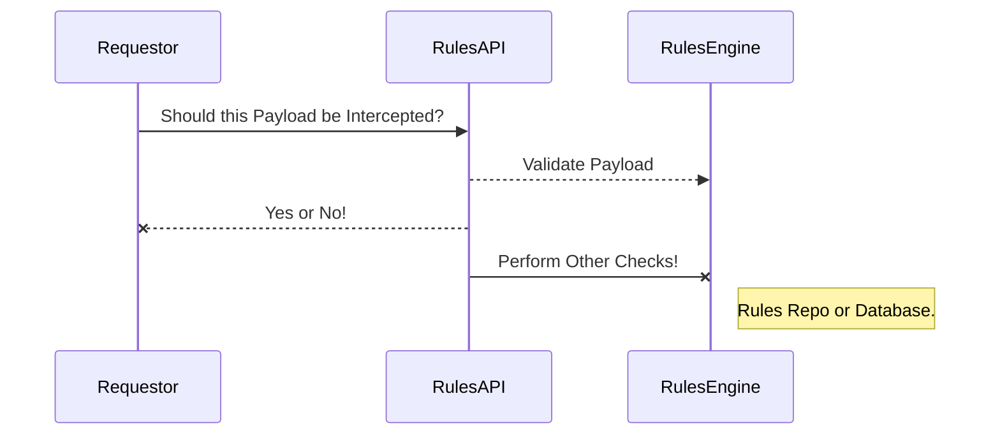
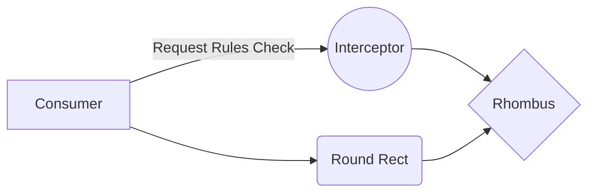

# JSON Rules Engine and Template Proof-of-Concept

```mermaid
sequenceDiagram
Requestor ->> RulesAPI: Should this Payload be Intercepted?
RulesAPI-->>RulesEngine: Validate Payload
RulesAPI--x Requestor: Yes or No!
RulesAPI-x RulesEngine: Perform Other Checks!
Note right of RulesEngine: Rules Repo or Database.
```

Flow Chart:

```mermaid
graph LR
A[Consumer] -- Request Rules Check --> B((Interceptor))
A --> C(Round Rect)
B --> D{Rhombus}
C --> D
```
