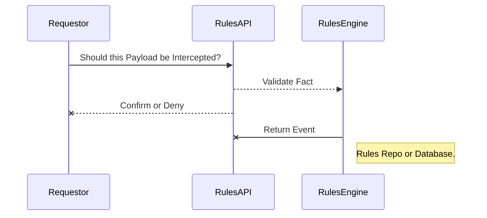
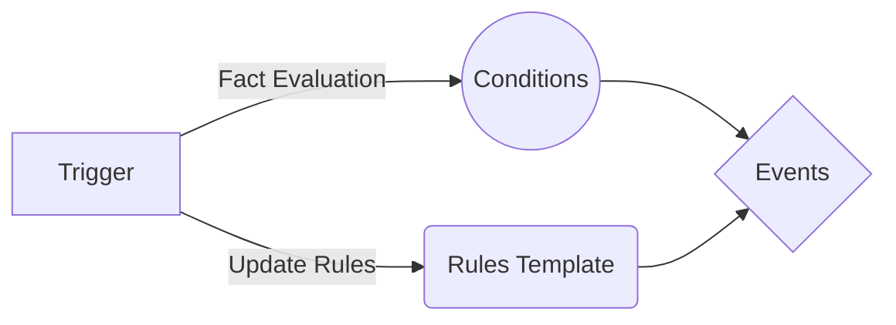

## JSON Rules Engine and Template Proof-of-Concept

We customize the open-source upstream ```json-rules-engine``` project to perform TMF-API Validations.

## Features

* Rules specified in JSON templates
* Full support for ```ALL``` and ```ANY``` boolean operators
* Specify ```priority levels``` and cache settings for fine tuning performance
* REST API interface
* Container Image on Docker Hub
* Can be deployed on OpenShift as Pod
* Can be part of EIP design pattern (as a Camel REST endpoint route)
* Can be exposed using OpenShift Route

## Installation

<div class="snippet-clipboard-content notranslate position-relative overflow-auto" data-snippet-clipboard-copy-content="oc apply -f rulesapi-v1.yaml -n {your namespace}"><pre class="notranslate"><code>oc apply -f rulesapi-v1.yaml -n {your namespace}</code></pre></div>

## Rules Template

Input: _Fact_ (Payload)
Output: _Event_

A Rules Template contains a set of mandatory _Conditions_ with optional priority settings.  Evaluate input _Fact_ using the defined _Conditions_ triggering output _Event_.

<div class="snippet-clipboard-content notranslate position-relative overflow-auto" data-snippet-clipboard-copy-content="{
  "conditions": {
    "all": [
      {
        "operator": "in",
        "value": [
          24735,
          0,
          111,
          222,
          333
        ],
        "fact": "oc"
      },
      {
        "operator": "equal",
        "value": 610,
        "fact": "fta"
      }
    ]
  },
  "event": {
    "type": "Intercepted",
    "params": {
      "message": "Operation Should be Intercepted!"
    }
  }
}"><pre class="notranslate"><code>
{
  "conditions": {
    "all": [
      {
        "operator": "in",
        "value": [
          24735,
          0,
          111,
          222,
          333
        ],
        "fact": "oc"
      },
      {
        "operator": "equal",
        "value": 610,
        "fact": "fta"
      }
    ]
  },
  "event": {
    "type": "Intercepted",
    "params": {
      "message": "Operation Should be Intercepted!"
    }
  }
}
</code></pre></div>

## Rules Workflow Sequence Diagram



## Rules Engine Component Relationships:


