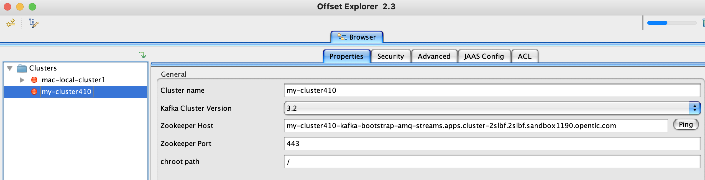
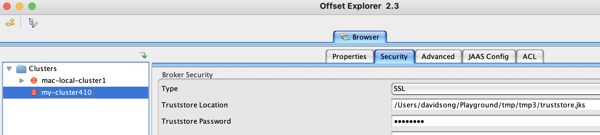
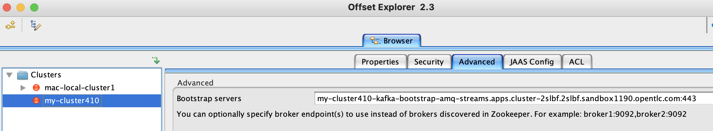

## Kafka Production Readiness and Performance Testing

We customize OpenShift Custom Resource ```Job``` to configure automated stress tests on Kafka clusters and topics.  Steps to analyze the collected data and recommend best practices for fine-tuning Production ready Kafka clusters.

## Summary 

* In order to determine the stability and performance of the current Kafka Brokers, a
series of tests were run. Due to limitations of resources, all of the tests were run from within the
same OCP cluster that the broker was running. The tests were run in environments that were
not empty so the results could be skewed by other clients using the broker.

* A new namespace ```perf-testing``` was created to run the tests from.  The tests send configurable amounts of messages to topics running on Kafka brokers on the ```amq-streams``` namespace.

* Alternatively, secure ```external route``` to Kafka ```bootstrap``` service can also be used.  TLS truststores must
be set up for the client (See Appendix). 

### Installation

* Edit ```yaml/kafka-test.yaml``` and provide your Kafka bootstrap cluster-local URL in the ```spec.template.spec.containers.args.bootstrap.servers```

* For example, ```my-cluster-kafka-brokers.amq-streams.svc.cluster.local:9092```

* The following yaml code can be applied in the
```perf-testing``` namespace by running this command 
```shell
oc apply -f yaml/kafka-testing.yaml -n perf-testing”
```


## Running and Analyzing Results

### Load Test Pods
- ```spec.parallelism``` defines the number of concurrent active Pods spin up to launch the stress tests 
- ```spec.completions``` instructs the Job to finish when all defined Pods are completed and spin down
- Below example shows three active load-test Pods


### Test Execution
- You can tail one of the Pod logs to watch the test execution
```shell
oc logs -f <pod-name> -n <project-name>
```


- You can use this command to monitor pod status, when all pods are finished, they will spin down
```shell
oc get pods --watch -n <project-name>
``` 

## Appendix: Offset Explorer

- NOTE: this tool is NOT supported by Red Hat, it is only used here for illustration purposes.
- Can be downloaded from:
```shell
https://www.kafkatool.com/download.html
```
- In this example, we are using an external OpenShift TLS-edge ```Route``` that proxies to the Kafka cluster ```bootstrap``` service
- If your Offset Explorer is installed locally within your OpenShift cluster, use the ```bootstrap``` cluster-local service instead
- On the ```Properties``` tab, enter your Kafka cluster name, select Kafka cluster version, enter your Kafka cluster Zookeeper endpoint and port.
- On the ```Security``` tab, select ```SSL``` and provide full path to your truststore that contains the Kafka server CA cert and truststore password
- This command can be used to extract and save the Kafka cluster server CA cert
```shell
oc extract secret/<your-kafka-cluster-name>-cluster-ca-cert --keys=ca.crt --to=- > ca.crt
```
- Then create a truststore from the CA cert
```shell
keytool -import -alias root -file ca.crt -storetype JKS -keystore truststore.jks
```
- Optional: on the ```Advanced``` tab, you can provide the ```bootstrap``` endpoint and port directly instead of having the tool to discover bootstrap through Zookeeper
- Following screenshots are provided as examples of above steps




